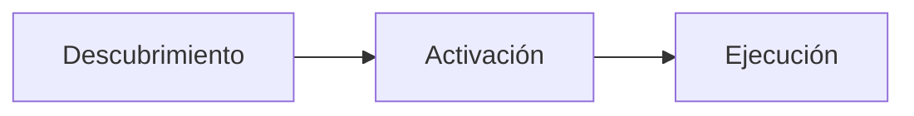

# 📚 Antigravity Skills - Mejores Prácticas Oficiales

> **Fuente**: [https://antigravity.google/docs/skills](https://antigravity.google/docs/skills)  
> **Última actualización**: 2026-01-19

---

## 1. ¿Qué son las Skills?

Las skills son un **estándar abierto** para extender las capacidades del agente. Consisten en una carpeta que contiene un archivo `SKILL.md` con instrucciones que el agente sigue para tareas específicas.

Cada skill contiene:
- **Instrucciones**: Guía sobre cómo abordar un tipo de tarea específica
- **Mejores prácticas**: Convenciones y estándares a seguir
- **Recursos opcionales**: Scripts, ejemplos y plantillas que el agente puede utilizar

---

## 2. Ubicación de las Skills

Antigravity admite **dos tipos de ubicaciones**:

| Tipo | Ruta | Uso |
|------|------|-----|
| **Local (Workspace)** | `<root-del-proyecto>/.agent/skills/<nombre-skill>/` | Flujos específicos del equipo o proyecto (ej. procesos de despliegue) |
| **Global** | `~/.gemini/antigravity/skills/<nombre-skill>/` | Disponibles para todos los proyectos (ej. utilidades personales) |

---

## 3. Creación de una Skill

Para crear una skill, se debe crear una carpeta con un archivo `SKILL.md` que incluya un **encabezado YAML (frontmatter)**:

```markdown
---
name: nombre-de-la-skill
description: Descripción clara de qué hace y cuándo usarla.
---
# Título de la Skill
Instrucciones detalladas aquí.
```

### Campos del Frontmatter

| Campo | Requerido | Descripción |
|-------|-----------|-------------|
| `name` | Opcional | Identificador único (por defecto es el nombre de la carpeta) |
| `description` | **Requerido** | Crucial porque el agente la usa para decidir si activa la skill. Escribir en tercera persona e incluir palabras clave |

---

## 4. Estructura de Carpetas Recomendada

```
skill-name/
├── SKILL.md          # Instrucciones principales (REQUERIDO)
├── scripts/          # Scripts de apoyo (opcional)
├── examples/         # Implementaciones de referencia (opcional)
└── resources/        # Plantillas y otros activos (opcional)
```

---

## 5. Funcionamiento del Agente con las Skills

El proceso sigue un patrón de **"divulgación progresiva"**:



1. **Descubrimiento**: Al iniciar la conversación, el agente ve una lista de nombres y descripciones de skills disponibles
2. **Activación**: Si una descripción parece relevante, el agente **lee el contenido completo** del `SKILL.md`
3. **Ejecución**: El agente aplica las instrucciones durante la tarea

> [!NOTE]
> El agente decide cuándo usarlas basándose en el contexto, pero el usuario puede pedir explícitamente que use una por su nombre.

---

## 6. 🌟 Mejores Prácticas (Best Practices)

### 6.1 Focalización
> **Una skill = Una responsabilidad**

Cada skill debe hacer **una sola cosa bien**. Es mejor tener varias skills específicas que una "todoterreno".

❌ **Mal**: Una skill de "Desarrollo" que maneja testing, deployment, y documentación  
✅ **Bien**: Skills separadas para `testing`, `deployment`, `documentation`

### 6.2 Descripciones Claras

La descripción es la **clave para la activación automática**. Debe especificar:
- **QUÉ** hace exactamente
- **CUÁNDO** es útil

```markdown
# ❌ Mal
description: Ayuda con código

# ✅ Bien  
description: Revisa cambios en el código buscando bugs, problemas de estilo 
             y mejores prácticas. Úsala antes de hacer merge a main.
```

### 6.3 Scripts como "Cajas Negras"

Si la skill incluye scripts, **instruye al agente para que los ejecute con `--help`** en lugar de leer todo el código fuente.

```markdown
# Instrucción en SKILL.md
Para validar el código, ejecuta:
\`\`\`bash
python scripts/validator.py --help
\`\`\`
Usa las opciones que correspondan según el contexto.
```

> [!TIP]
> Esto **ahorra contexto** y evita que el agente pierda tiempo analizando código que no necesita entender.

### 6.4 Árboles de Decisión

Para skills complejas, incluye secciones que ayuden al agente a elegir el enfoque correcto:

```markdown
## Cuándo Usar Esta Skill

| Situación | Acción |
|-----------|--------|
| Archivo nuevo | Usar template de `examples/` |
| Archivo existente | Validar estilo primero |
| Error de runtime | Revisar logs antes de modificar |
```

---

## 7. Ejemplo Completo: Skill de Revisión de Código

```markdown
---
name: code-review
description: Revisa cambios en el código buscando bugs, estilo y mejores prácticas. 
             Activar al revisar PRs o antes de commits importantes.
---
# Skill de Revisión de Código

## Checklist de Revisión

1. **Corrección**: ¿Hace lo que se supone que hace?
2. **Casos borde**: ¿Maneja errores y edge cases?
3. **Estilo**: ¿Sigue las convenciones del proyecto?
4. **Desempeño**: ¿Hay ineficiencias obvias?

## Formato de Feedback

- Sé **específico** sobre la ubicación del problema
- Explica el **"por qué"** detrás de cada observación
- Sugiere **alternativas concretas**
```

---

## 8. Checklist de Validación de Skills

Antes de considerar una skill lista para uso:

- [ ] ¿Tiene `SKILL.md` con frontmatter válido?
- [ ] ¿La `description` es clara y contiene palabras clave relevantes?
- [ ] ¿Sigue el principio de responsabilidad única?
- [ ] ¿Los scripts tienen `--help` implementado?
- [ ] ¿Incluye ejemplos o templates si son necesarios?
- [ ] ¿Las instrucciones son claras y accionables?

---

## 9. Integración con Skills proyectos

En nuestra biblioteca (`C:\Users\ASUS\.gemini\Skills proyectos`), seguimos esta estructura:

```
Skills proyectos/
├── .agent/skills/
│   ├── _core/              # Skills fundamentales (siempre disponibles)
│   │   ├── skill-router/
│   │   └── project-standards/
│   ├── automation/         # Automatización
│   │   └── n8n-workflows/
│   ├── by-domain/          # Organizadas por dominio
│   │   ├── code-quality/
│   │   ├── development/
│   │   ├── sap/
│   │   └── ...
│   └── projects/           # Skills específicas de proyectos
├── docs/                   # Documentación (aquí estás)
└── tools/                  # Herramientas auxiliares
```

### Flujo para Nuevos Proyectos

1. **Crear** carpeta del proyecto con `.agent/skills/`
2. **Identificar** qué skills del catálogo necesita
3. **Copiar** solo las skills relevantes al proyecto
4. **Personalizar** si es necesario para requisitos específicos

---

> [!IMPORTANT]
> Este documento debe mantenerse sincronizado con la documentación oficial de Antigravity.  
> Última verificación: 2026-01-19
